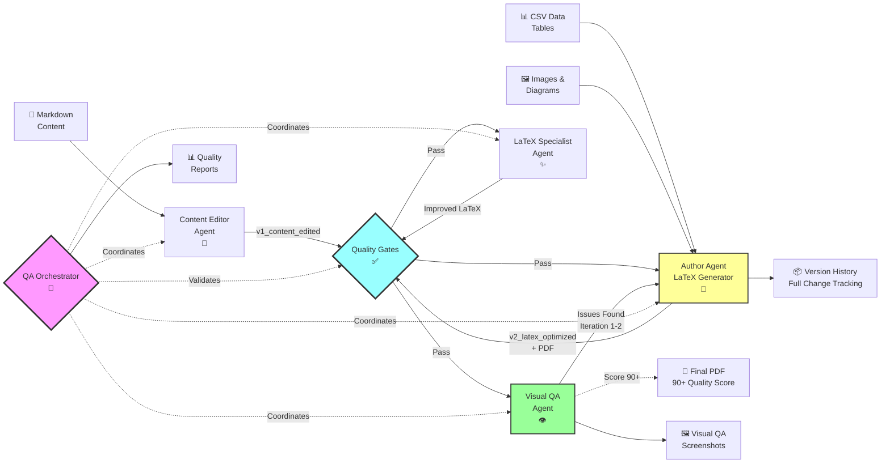

# DeepAgent Scribe - Intelligent LaTeX Research Report Generator

An advanced multi-agent system that generates professional LaTeX research reports with comprehensive quality assurance, LLM-based document optimization, and automated visual quality analysis.

## ⚠️ Important Notice

**Disclaimer**: This software is provided "as-is" without warranty of any kind. The author is not liable for any damages or issues arising from the use of this software.

**Security Warning**: This project uses third-party packages and AI services (Claude API). Before using this software, especially in scenarios involving confidential data or private information:
- Review all third-party dependencies in `requirements.txt`
- Understand that content is sent to external LLM APIs (Anthropic Claude)
- Conduct your own security assessment for your use case
- Never process sensitive, proprietary, or confidential information without proper security measures
- Consider running in an isolated environment for sensitive workflows

By using this software, you acknowledge these risks and agree to conduct appropriate due diligence.

## Features

### Core Capabilities
- **LLM-Based LaTeX Generation**: Intelligent document creation with Claude Sonnet 4.5
- **Self-Correcting Compilation**: Automatic error detection and fix generation
- **Multi-Agent QA Pipeline**: Automated quality assurance with specialized agents
- **Visual Quality Analysis**: AI-powered PDF layout and typography analysis
- **Iterative Refinement**: Progressive quality improvement over multiple passes
- **Version Tracking**: Complete change history with diff generation

### Document Features
- Professional LaTeX reports with customizable structure
- Automatic table of contents and citations
- Data tables from CSV files
- Image placement with text wrapping
- Vector diagrams support
- PDF compilation with pdflatex
- Hyperlink and cross-reference support

## System Architecture



## Quick Start

### Prerequisites
- Docker Desktop (installed and running)
- Anthropic API key (for Claude)

### Setup

1. **Copy the environment file and add your API keys:**
   ```bash
   cp .env.example .env
   ```
   Edit `.env` and add your `ANTHROPIC_API_KEY`

2. **Build and run the Docker container:**
   ```bash
   docker-compose build
   docker-compose run --rm deepagent-scribe
   ```

3. **Run the automated QA pipeline:**
   ```bash
   python agents/qa_orchestrator/agent.py
   ```

## Project Structure

```
deepagent-scribe/
├── agents/
│   ├── research_agent/       # Author Agent: LaTeX document generation
│   ├── content_editor/       # Grammar, readability, and style improvement
│   ├── latex_specialist/     # LaTeX formatting and typography optimization
│   ├── visual_qa/            # Visual PDF quality analysis with LLM feedback
│   └── qa_orchestrator/      # Multi-agent workflow coordination
├── tools/
│   ├── llm_latex_generator.py    # LLM-based LaTeX generation with self-correction
│   ├── latex_generator.py        # Traditional LaTeX template generator
│   ├── pdf_compiler.py           # PDF compilation with error handling
│   ├── visual_qa.py              # Visual quality analysis with Claude vision
│   ├── version_manager.py        # File versioning system
│   └── change_tracker.py         # Content change tracking and diffs
├── artifacts/
│   ├── sample_content/           # Source markdown, images, and CSV data
│   ├── reviewed_content/         # Versioned content improvements
│   │   ├── v0_original/          # Original source content
│   │   ├── v1_content_edited/    # After content review
│   │   ├── v2_latex_optimized/   # After LaTeX optimization (includes PDF)
│   │   └── v3_visual_qa/         # Visual QA analysis and iterative improvements
│   │       ├── page_images/      # PDF screenshots for analysis
│   │       └── iterations/       # Iterative PDF improvements
│   ├── agent_reports/
│   │   ├── quality/              # Content & LaTeX quality reports
│   │   └── orchestration/        # Pipeline execution reports
│   ├── version_history/
│   │   ├── changes/              # Change summaries between versions
│   │   ├── diffs/                # Detailed diffs
│   │   └── version_manifest.json # Complete version tracking
│   └── output/                   # Generated LaTeX and PDF files
├── .deepagents/                  # Persistent agent memory storage
├── Dockerfile
├── docker-compose.yml
└── requirements.txt
```

## Workflow Details

### Automated Pipeline (Recommended)

Run the QA orchestrator for a fully automated multi-agent workflow:

```bash
python agents/qa_orchestrator/agent.py
```

**Pipeline Stages:**

1. **Content Review** (Content Editor Agent)
   - Grammar and spelling correction
   - Readability improvement
   - Style consistency
   - Quality scoring (0-100)

2. **LaTeX Generation** (Author Agent + LLM Generator)
   - Markdown to LaTeX conversion
   - Table generation from CSV
   - Image and figure placement
   - Citation handling
   - Initial PDF compilation

3. **LaTeX Optimization** (LaTeX Specialist Agent)
   - Typography improvements
   - Formatting enhancements
   - Structure optimization
   - Best practices enforcement
   - Quality scoring (0-100)

4. **Visual QA** (Visual QA Agent + Claude Vision)
   - PDF to image conversion
   - Page-by-page visual analysis
   - Layout quality assessment
   - Typography validation
   - **LLM Self-Correction Loop:**
     - Issues detected → LLM generates fixes
     - Compilation attempted
     - If errors → LLM analyzes and re-generates
     - Repeat until successful or max attempts

5. **Quality Gates**
   - Validates each stage meets thresholds
   - Decides: pass, iterate, or escalate
   - Tracks quality progression
   - Generates comprehensive reports

### Quality Thresholds

```python
Content Quality:
  Minimum: 80/100
  Good: 85/100
  Excellent: 90/100

LaTeX Quality:
  Minimum: 85/100
  Good: 90/100
  Excellent: 95/100

Overall Pipeline:
  Target: 80/100
  Human Handoff: 90/100
```

## LLM-Based Tools

### LLM LaTeX Generator
The system uses Claude Sonnet 4.5 for intelligent LaTeX generation:

**Features:**
- Reasons about document structure and formatting
- Handles edge cases dynamically
- Self-corrects compilation errors
- Learns from feedback loops
- Avoids problematic package combinations

**Self-Correction Loop:**
```
1. Generate LaTeX → 2. Compile
                      ↓
                   Error?
                      ↓
3. LLM analyzes error ← Yes
   ↓
4. Generate corrected version
   ↓
5. Retry compilation (max 3 attempts)
```

### Visual QA with Claude Vision
Uses multimodal LLM analysis for PDF quality:

**Analyzed Aspects:**
- Title page layout and typography
- Table of contents structure
- Content page formatting
- Header/footer consistency
- Figure and table quality
- **Critical:** LaTeX syntax detection (flags unrendered LaTeX commands)

## Version Control System

All content versions are tracked with complete change history:

**Version Progression:**
```
v0_original (baseline markdown content)
  ↓
v1_content_edited (improved content)
  ↓
v2_latex_optimized (LaTeX + initial PDF)
  ↓
v3_visual_qa (visual analysis + iterative PDF improvements)
```

**Change Tracking:**
- JSON diff between versions
- Markdown summary of changes
- File-level change tracking
- Quality score progression
- Agent metadata and timestamps

## Output Files

After running the pipeline:

```
artifacts/
├── reviewed_content/              # All versioned content
│   ├── v2_latex_optimized/
│   │   ├── research_report.pdf   # Initial PDF
│   │   └── research_report.tex   # LaTeX source
│   └── v3_visual_qa/
│       ├── page_images/          # PDF screenshots (page_01.png, etc.)
│       └── iterations/
│           ├── iteration_1.pdf   # After first improvement
│           └── iteration_2.pdf   # After second improvement
├── output/                        # Working directory (not versioned)
│   ├── research_report.pdf       # Latest PDF
│   └── research_report.tex       # Latest LaTeX
├── agent_reports/
│   ├── quality/
│   │   └── content_review_report.md
│   └── orchestration/
│       └── qa_pipeline_summary.md
└── version_history/
    ├── changes/
    │   └── v0_to_v1_summary.md
    └── version_manifest.json
```

## Manual Agent Execution

For granular control, run individual agents:

**Content Quality Review:**
```bash
python agents/content_editor/agent.py
```

**LaTeX Generation (Author Agent):**
```bash
python agents/research_agent/agent.py
```

**LaTeX Optimization:**
```bash
python agents/latex_specialist/agent.py
```

**Visual Quality Analysis:**
```bash
python agents/visual_qa/agent.py
```

## Development

### Adding Custom Content

1. Place markdown files in `artifacts/sample_content/`
2. Add CSV tables to `artifacts/sample_content/data/`
3. Add images to `artifacts/sample_content/images/`
4. Run the pipeline

### Extending Agents

Each agent follows the DeepAgents framework pattern:
- Persistent memory in `.deepagents/[agent_name]/memories/`
- Configurable quality thresholds
- Versioned outputs
- Comprehensive reporting

### Customizing Quality Gates

Edit `agents/qa_orchestrator/quality_gates.py`:

```python
QualityThresholds(
    content_minimum=80,
    latex_minimum=85,
    overall_target=80,
    max_iterations=3
)
```

## Troubleshooting

### Common Issues

**Docker Build Fails:**
- Ensure Docker Desktop is running
- Check for symlink issues on Windows (delete `current` symlinks)

**API Errors:**
- Verify `ANTHROPIC_API_KEY` is set in `.env`
- Check API rate limits

**PDF Compilation Fails:**
- Check LaTeX logs in `artifacts/output/`
- LLM self-correction will attempt fixes automatically
- Review error messages in console output

**Visual QA Errors:**
- Ensure `poppler-utils` is installed in Docker
- Check PDF exists at expected path
- Verify Claude API has vision enabled

## Architecture Highlights

### Multi-Agent Coordination
- **QA Orchestrator** manages workflow state machine
- **Quality Gates** enforce standards and decision logic
- **Version Manager** tracks all content changes
- **Change Tracker** generates detailed diffs

### LLM Integration
- **Claude Sonnet 4.5** for LaTeX generation and correction
- **Claude Haiku** for content analysis
- **Claude Vision** for PDF visual quality assessment
- **Temperature tuning** for consistent vs. creative outputs

### Quality Assurance
- Automated testing at each pipeline stage
- Progressive quality improvement over iterations
- Human-in-the-loop escalation when needed
- Comprehensive reporting and analytics

## License

MIT License

THE SOFTWARE IS PROVIDED "AS IS", WITHOUT WARRANTY OF ANY KIND, EXPRESS OR IMPLIED, INCLUDING BUT NOT LIMITED TO THE WARRANTIES OF MERCHANTABILITY, FITNESS FOR A PARTICULAR PURPOSE AND NONINFRINGEMENT. IN NO EVENT SHALL THE AUTHORS OR COPYRIGHT HOLDERS BE LIABLE FOR ANY CLAIM, DAMAGES OR OTHER LIABILITY, WHETHER IN AN ACTION OF CONTRACT, TORT OR OTHERWISE, ARISING FROM, OUT OF OR IN CONNECTION WITH THE SOFTWARE OR THE USE OR OTHER DEALINGS IN THE SOFTWARE.
